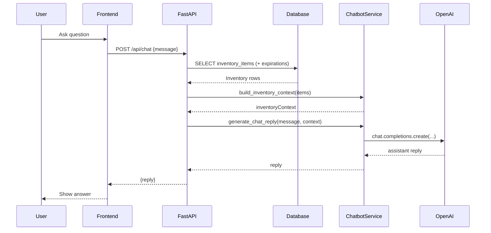
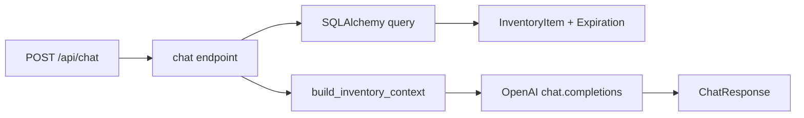

# Chatbot Backend Flow (Shelf It)

This document describes exactly what happens in the backend when a user sends a chat question, including request flow, data access, and the files involved.

## Request Flow Summary

1. **Frontend** sends `POST /api/chat` with JSON: `{ "message": "..." }`.
2. **FastAPI router** dispatches to the chat endpoint.
3. **Chat endpoint** loads current inventory from the database.
4. **Backend** builds an inventory context string.
5. **OpenAI client** is called with system + user messages.
6. **Backend** returns the assistant reply as JSON.

## Sequence Diagram



## Endpoint And Data Flow (Step-by-Step)

### 1) API Endpoint
- **File**: `backend/app/api/endpoints/chat.py`
- **Route**: `POST /api/chat`
- **Input**: `ChatRequest` (`backend/app/schemas/chat.py`)
- **Output**: `ChatResponse`

Flow inside the endpoint:
1. Fetch all `InventoryItem` rows.
2. For each item, extract:
   - `name`
   - `quantity`
   - `expiration_date` (if present)
3. Build a context string using the list above.
4. Ask OpenAI and return the reply text.

### 2) Inventory Context Construction
- **File**: `backend/app/services/chatbot.py`
- **Function**: `build_inventory_context(items: list[dict]) -> str`

Format example:
```
- bread x1 (expires 2026-01-31)
- yogurt x2
```

### 3) OpenAI Request
- **File**: `backend/app/services/chatbot.py`
- **Function**: `generate_chat_reply(message, inventory_context)`
- **Client**: `OpenAI(...)` from the `openai` SDK
- **Model**: `settings.openai_model` (default `gpt-4o-mini`)
- **Messages**:
  - System: assistant role and behavior.
  - System: inventory context.
  - User: actual question.

### 4) Environment Configuration
- **File**: `backend/app/core/config.py`
- **Settings**: `openai_api_key`, `openai_model`
- **Source**: `.env` or environment variables.

## Files Touched During A Chat Request

Runtime call stack touches the following files:

1. `backend/app/main.py`
   - FastAPI app setup, router registration.
2. `backend/app/api/router.py`
   - Registers `/api/chat`.
3. `backend/app/api/endpoints/chat.py`
   - Core request handler.
4. `backend/app/models/inventory.py`
   - SQLAlchemy models for `InventoryItem` and `Expiration`.
5. `backend/app/db/session.py`
   - Database session/engine.
6. `backend/app/services/chatbot.py`
   - Context creation + OpenAI call.
7. `backend/app/schemas/chat.py`
   - Request/response schemas.
8. `backend/app/core/config.py`
   - OpenAI config lookup.

## Data Access Diagram



## Notes And Failure Modes

- **Missing API key**: `generate_chat_reply()` returns a friendly message.
- **OpenAI errors**: Exceptions will currently bubble up as 500s unless caught.
- **Empty inventory**: Context is `"Inventory is empty."`, so responses should be generic.

## Quick Test

```
curl -X POST http://127.0.0.1:8000/api/chat \
  -H "Content-Type: application/json" \
  -d '{"message":"What can I cook?"}'
```
